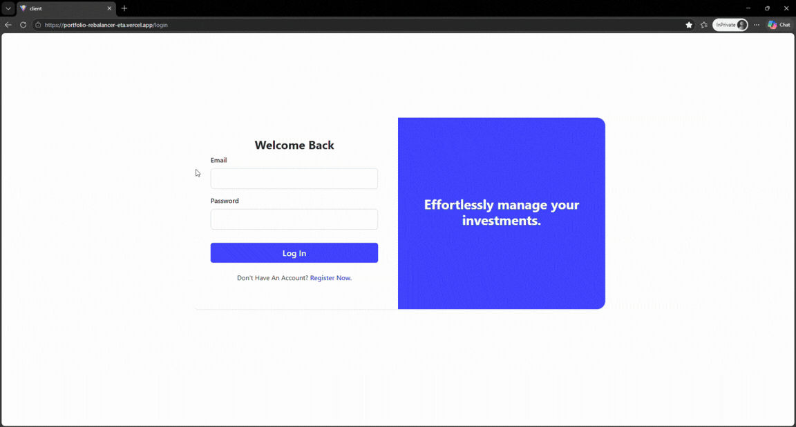

# 💰 Portfolio Rebalancer

[](https://github.com/MatheusPMello/portfolio-rebalancer/actions/workflows/ci.yml)

**[🚀 View Live Demo](https://portfolio-rebalancer-eta.vercel.app/)**

---

Managing a multi-currency investment portfolio is surprisingly painful — spreadsheets break, the math gets messy across
currencies, and selling assets triggers unnecessary taxes. Portfolio Rebalancer automates the allocation math using a *
*buy-only strategy**, so you can put new capital to work intelligently without ever needing to sell.

---

> 
---

## ✨ Features

* **🔐 Secure Authentication:** JWT-based registration and login with protected routes.
* **🌍 Multi-Currency Support:** Manage BRL and USD assets side-by-side in a single dashboard.
* **🤖 Smart Rebalancing Engine:** Calculates optimal allocation for new contributions using buy-only logic, with
  automatic currency normalization.
* **📡 Real-Time Exchange Rates:** Integrates with AwesomeAPI to fetch live USD/BRL rates for accurate valuations.
* **📊 Visual Analytics:** Interactive Clustered Bar Charts (Chart.js) comparing Current vs. Target allocation.

---

## 🛠️ Tech Stack

### Frontend
   

### Backend
  

### Infrastructure & DevOps

     

---

## 📂 Architecture

Monorepo structure separating client and server environments.

```text
/portfolio-rebalancer/
|-- /client/                  # React Application (Frontend)
|   |-- /src/
|   |   |-- /components/      # Reusable UI (AuthLayout, MainLayout, Charts)
|   |   |-- /pages/           # View Logic (Dashboard, Login)
|   |   |-- /services/        # API integration (assetService, authService)
|
|-- /server/                  # Node.js API (Backend)
|   |-- /src/
|   |   |-- /controllers/     # Request Logic
|   |   |-- /middlewares/     # Auth Guards
|   |   |-- /models/          # Database Queries (SQL)
|   |   |-- /services/        # External APIs (Exchange Rate logic)
|
|-- docker-compose.yml        # Database Container Config
```

---

## 🚀 Getting Started

### Prerequisites

* [Node.js](https://nodejs.org/) v18+
* [Docker Desktop](https://www.docker.com/products/docker-desktop/) (must be running)

### 1. Clone & Configure

```bash
git clone https://github.com/MatheusPMello/portfolio-rebalancer.git
cd portfolio-rebalancer
cp server/.env.example server/.env
```

The `.env.example` is pre-configured to work with the local Docker database — no changes needed for local development.

### 2. Setup

```bash
npm run setup
```

This installs dependencies, starts the Docker database, and creates the required tables.

> **Note:** If the database step fails, make sure Docker Desktop is running, then run `npm run db:init` manually.

### 3. Run

```bash
npm run dev
```

Open [http://localhost:5173](http://localhost:5173) in your browser.

---

## 📦 API Reference

### Auth

| Method | Endpoint             | Description                |
|--------|----------------------|----------------------------|
| `POST` | `/api/auth/register` | Create account             |
| `POST` | `/api/auth/login`    | Authenticate & receive JWT |

### Assets

| Method   | Endpoint          | Description          |
|----------|-------------------|----------------------|
| `GET`    | `/api/assets`     | List all user assets |
| `POST`   | `/api/assets`     | Create new asset     |
| `PUT`    | `/api/assets/:id` | Update asset details |
| `DELETE` | `/api/assets/:id` | Remove asset         |

### Rebalancing

| Method | Endpoint         | Description                  |
|--------|------------------|------------------------------|
| `POST` | `/api/rebalance` | Calculate optimal allocation |

**Rebalance payload:**

```json
{
  "amount": 1000,
  "mainCurrency": "BRL"
}
```

Returns a list of assets to buy with amounts converted to each asset's native currency.

---

## 🤖 CI/CD

A GitHub Actions pipeline runs on every push and pull request to `main`. It verifies backend unit tests (Jest) and the
frontend TypeScript build, ensuring no broken code reaches production.