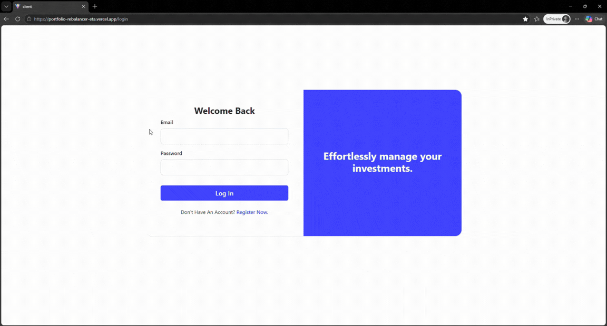

# 💰 Portfolio Rebalancer

[](https://github.com/MatheusPMello/portfolio-rebalancer/actions/workflows/ci.yml)
[](https://opensource.org/licenses/ISC)
[](./client)
[](./server)

**[🚀 View Live Demo](https://portfolio-rebalancer-eta.vercel.app/)**

---

Managing a multi-currency investment portfolio is surprisingly painful—spreadsheets break, exchange rate math gets messy, and selling assets to rebalance triggers unwanted capital gains taxes and transaction fees.

**Portfolio Rebalancer** automates allocation math using a **buy-only strategy**. It calculates exactly how to distribute your new contributions to bring your portfolio as close as possible to your target weights—**without ever needing to sell a single asset.**

---

> 

---

## ✨ Features

- **🌍 Multi-Currency Support:** Manage Brazilian Real (BRL) and US Dollar (USD) assets side-by-side in a single dashboard.
- **🤖 Smart Rebalancing Engine:** Computes optimal purchase distributions for incoming contributions using a greedy buy-only algorithm with automatic currency normalization.
- **📡 Real-Time Exchange Rates:** Automatically retrieves live USD/BRL conversion rates via **AwesomeAPI** to ensure accurate valuation.
- **📊 Visual Analytics:** View current vs. target allocations side-by-side using interactive clustered bar charts (Chart.js).
- **🔐 Secure Authentication:** Full JWT-based registration, login, and protected routes.
- **⚙️ Profile & Account Management:** Full control over your account, allowing you to update your email, password, or delete your account.

---

## 📂 Architecture

This project is structured as a **Monorepo** to keep client and server environments separated yet organized in a single repository:

```text
/portfolio-rebalancer/
|-- /client/                  # React Application (Frontend)
|   |-- /src/
|   |   |-- /components/      # UI Components (Charts, Modals, Layouts, Badge)
|   |   |-- /pages/           # Page views (Dashboard, Login, Register)
|   |   |-- /services/        # API communication Layer (auth, assets, rebalance)
|   |   |-- /utils/           # Financial calculations and helpers
|
|-- /server/                  # Node.js Express API (Backend)
|   |-- /src/
|   |   |-- /config/          # Database & setup configurations
|   |   |-- /controllers/     # Request/Response route handler logic
|   |   |-- /middlewares/     # Auth Guards (JWT validation)
|   |   |-- /models/          # Database queries and schema models (SQL)
|   |   |-- /routes/          # Express route definitions
|   |   |-- /services/        # Rebalancing calculations & External APIs
|
|-- docker-compose.yml        # Local PostgreSQL Docker Container Config
```

---

## 🗄️ Database Schema

The database uses a clean PostgreSQL relational schema comprising two tables:

### 1. `users` Table

Stores user registration and authentication information.

- `id` (SERIAL, Primary Key)
- `email` (VARCHAR(255), Unique, Not Null)
- `password_hash` (VARCHAR(255), Not Null)
- `created_at` (TIMESTAMP, Defaults to CURRENT_TIMESTAMP)

### 2. `assets` Table

Stores investment assets associated with users.

- `id` (SERIAL, Primary Key)
- `user_id` (INTEGER, Foreign Key referencing `users(id)` ON DELETE CASCADE)
- `name` (VARCHAR(100), Not Null) - e.g., "AAPL", "IVVB11"
- `target_percentage` (DECIMAL(5, 2), Not Null) - e.g., 20.00%
- `current_value` (DECIMAL(12, 2), Not Null) - e.g., 1500.00
- `currency` (VARCHAR(3), Not Null) - "USD" or "BRL"
- `created_at` (TIMESTAMP, Defaults to CURRENT_TIMESTAMP)

---

## 🧮 Core Rebalancing Algorithm

The rebalancing calculation runs in `server/src/services/rebalanceService.ts` and operates in 5 clear phases:

1. **Normalization:** Converts all asset current values to the user's primary currency (e.g. converting USD asset values to BRL using live exchange rates).
2. **Future Value Projection:** Projects the total portfolio value after the new contribution is added:
   $$\text{Future Total} = \text{Current Total} + \text{Contribution}$$
3. **Gap Analysis (Buy-Only constraint):** Calculates the monetary gap between the target value and current value for each asset. If an asset is overweight (current value is greater than target), its gap is locked at `0` (since we do not sell):
   $$\text{Gap}_i = \max(0, (\text{Future Total} \times \text{Target}_i) - \text{Current Value}_i)$$
4. **Contribution Distribution:** Distributes the contribution proportionally to each asset's weight in the total gap:
   $$\text{Amount to Buy (Normalized)}_i = \text{Contribution} \times \frac{\text{Gap}_i}{\sum \text{Gaps}}$$
5. **Denormalization:** Converts the allocated contribution amount back into each asset's native currency (BRL or USD) for the user to execute.

```typescript
// Core implementation snippet
export const calculateRebalancePlan = (
  contribution: number,
  assets: AssetRecord[],
  usdRate: number,
  mainCurrency: 'BRL' | 'USD',
): RebalanceSuggestion[] => {
  // Normalize all assets to the 'Main Currency'
  const normalizedAssets = assets.map((asset) => {
    const currentValue = Number(asset.current_value);
    const normalizedValue =
      mainCurrency === 'BRL' && asset.currency === 'USD'
        ? currentValue * usdRate
        : mainCurrency === 'USD' && asset.currency === 'BRL'
          ? currentValue / usdRate
          : currentValue;
    return { ...asset, normalizedValue, targetPercentage: Number(asset.target_percentage) };
  });

  const totalCurrentValue = normalizedAssets.reduce((sum, a) => sum + a.normalizedValue, 0);
  const totalFutureValue = totalCurrentValue + contribution;

  // Calculate under-allocation gaps
  let totalGap = 0;
  const assetsWithGaps = normalizedAssets.map((asset) => {
    const targetValue = totalFutureValue * (asset.targetPercentage / 100);
    const difference = Math.max(0, targetValue - asset.normalizedValue);
    totalGap += difference;
    return { ...asset, difference };
  });

  // Distribute contribution and convert back to native currency
  return assetsWithGaps
    .map((asset) => {
      const amountToBuyNormalized = totalGap > 0 ? contribution * (asset.difference / totalGap) : 0;
      const finalAmountNative =
        mainCurrency === 'BRL' && asset.currency === 'USD'
          ? amountToBuyNormalized / usdRate
          : mainCurrency === 'USD' && asset.currency === 'BRL'
            ? amountToBuyNormalized * usdRate
            : amountToBuyNormalized;

      return {
        assetId: asset.id,
        name: asset.name,
        currency: asset.currency,
        currentPercentage:
          totalCurrentValue > 0
            ? ((asset.normalizedValue / totalCurrentValue) * 100).toFixed(2)
            : '0.00',
        targetPercentage: asset.targetPercentage,
        amountToBuy: Number(finalAmountNative.toFixed(2)),
      };
    })
    .filter((s) => s.amountToBuy > 0.01);
};
```

---

## 📦 API Reference

All requests and responses use JSON. Routes under `/api/assets`, `/api/rebalance`, and `/api/user` require an `Authorization` header with a valid JWT Bearer token: `Authorization: Bearer <token>`.

### 🔐 Authentication

| Method | Endpoint             | Description                 | Request Body                                                    |
| :----- | :------------------- | :-------------------------- | :-------------------------------------------------------------- |
| `POST` | `/api/auth/register` | Create a new user account   | `{ "email": "user@example.com", "password": "securepassword" }` |
| `POST` | `/api/auth/login`    | Authenticate and obtain JWT | `{ "email": "user@example.com", "password": "securepassword" }` |

### 💰 Assets Management

| Method   | Endpoint          | Description          | Request Body                                                                                                |
| :------- | :---------------- | :------------------- | :---------------------------------------------------------------------------------------------------------- |
| `GET`    | `/api/assets`     | Get all user assets  | _None (Header Auth)_                                                                                        |
| `POST`   | `/api/assets`     | Create a new asset   | `{ "name": "AAPL", "target_percentage": 25, "current_value": 1500, "currency": "USD" }`                     |
| `PUT`    | `/api/assets/:id` | Update asset details | `{ "name": "AAPL", "target_percentage": 30, "current_value": 1800, "currency": "USD" }` (or partial fields) |
| `DELETE` | `/api/assets/:id` | Remove an asset      | _None (Header Auth)_                                                                                        |

### 🤖 Rebalancing

| Method | Endpoint         | Description                           | Request Body                                |
| :----- | :--------------- | :------------------------------------ | :------------------------------------------ |
| `POST` | `/api/rebalance` | Calculate rebalancing recommendations | `{ "amount": 1000, "mainCurrency": "BRL" }` |

### ⚙️ User Settings

| Method   | Endpoint             | Description                       | Request Body                                                                |
| :------- | :------------------- | :-------------------------------- | :-------------------------------------------------------------------------- |
| `GET`    | `/api/user/profile`  | Get authenticated user info       | _None (Header Auth)_                                                        |
| `PUT`    | `/api/user/email`    | Update user email address         | `{ "email": "newemail@example.com", "currentPassword": "currentpassword" }` |
| `PUT`    | `/api/user/password` | Update user password              | `{ "currentPassword": "oldpassword", "newPassword": "newsecurepassword" }`  |
| `DELETE` | `/api/user/account`  | Delete account and all its assets | `{ "password": "currentpassword" }`                                         |

### 🌍 Currency Data

| Method | Endpoint                      | Description                      | Request Body |
| :----- | :---------------------------- | :------------------------------- | :----------- |
| `GET`  | `/api/currency/exchange-rate` | Fetch live USD/BRL exchange rate | _None_       |

---

## 🚀 Getting Started

### Prerequisites

- [Node.js](https://nodejs.org/) v18 or newer
- [Docker Desktop](https://www.docker.com/products/docker-desktop/) (must be running for database virtualization)

### 1. Clone & Configure

Clone the repository and copy the server environment file:

```bash
git clone https://github.com/MatheusPMello/portfolio-rebalancer.git
cd portfolio-rebalancer
cp server/.env.example server/.env
```

_Note: The `.env.example` comes pre-configured to hook into the local Docker PostgreSQL database immediately, so no modification is needed for local development._

### 2. Setup Dependencies & Initialize Database

Install dependencies for all workspaces, spin up the Docker database container, and run database table initialization:

```bash
npm run setup
```

_Troubleshooting: If the database script fails, ensure your Docker Desktop is open and active, then execute `npm run db:init` manually._

### 3. Run the Application

Launch both the Express server and Vite React client concurrently:

```bash
npm run dev
```

Your browser will automatically open, or you can navigate to **[http://localhost:5173](http://localhost:5173)**. The server will run on port `5001`.

---

## 🧪 Testing, Linting & Formatting

Quality assurance configuration is setup for both backend and frontend suites.

### Running Unit Tests

Run all unit test suites (Vitest for client, Jest for server) in CI mode:

```bash
npm run test:all
```

Alternatively, you can test the packages individually:

- **Backend Tests (Jest):** `npm test`
- **Frontend Tests (Vitest):** `npm test --prefix client`

### Code Quality (Linting)

Run ESLint checks across both the client and server:

```bash
npm run lint
```

Automatically fix linting issues:

```bash
npm run lint:fix
```

### Code Formatting

Enforce consistent coding styles using Prettier:

```bash
npm run format
```

---

## 🤖 CI/CD Pipeline

This project implements a automated CI pipeline using **GitHub Actions** (`.github/workflows/ci.yml`). On every push or pull request to the `main` branch, the pipeline executes the following checks:

1. **Server Unit Tests:** Installs backend dependencies, lints code, and runs tests through Jest.
2. **Client Build & Type Check:** Installs frontend dependencies, lints code, runs unit tests through Vitest, and verifies that the production asset compilation succeeds without TypeScript compile errors.
