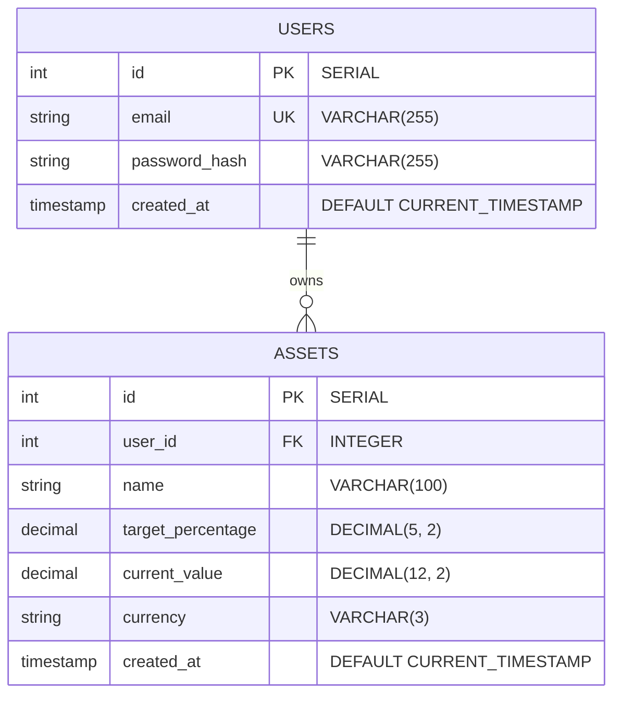

# 🗄️ Database Schema Documentation

This document describes the database schema of the **Portfolio Rebalancer** application. The database is built on PostgreSQL, using a relational schema to manage users and their portfolios.

---

## 📊 Entity Relationship Diagram (ERD)

---

## 🔑 Tables

### 1. `users`

Stores authentication credentials and account metadata.

| Column | Type | Constraints | Description |
| :--- | :--- | :--- | :--- |
| `id` | `INTEGER` | `PRIMARY KEY`, `SERIAL` | Unique auto-incrementing ID. |
| `email` | `VARCHAR(255)` | `UNIQUE`, `NOT NULL` | User email used for authentication. |
| `password_hash` | `VARCHAR(255)` | `NOT NULL` | Bcrypt hashed password. |
| `created_at` | `TIMESTAMP` | `DEFAULT CURRENT_TIMESTAMP` | Account creation timestamp. |

### 2. `assets`

Stores specific assets added by a user, along with current value allocations and target rebalancing weights.

| Column | Type | Constraints | Description |
| :--- | :--- | :--- | :--- |
| `id` | `INTEGER` | `PRIMARY KEY`, `SERIAL` | Unique auto-incrementing ID. |
| `user_id` | `INTEGER` | `FOREIGN KEY` -> `users(id)`, `NOT NULL` | Owner of the asset. Cascades deletion. |
| `name` | `VARCHAR(100)` | `NOT NULL` | Display name of the asset (e.g., TSLA, BOVA11). |
| `target_percentage` | `DECIMAL(5, 2)` | `NOT NULL` | The user's desired asset weight percentage. |
| `current_value` | `DECIMAL(12, 2)` | `NOT NULL` | The current value/amount invested in the asset. |
| `currency` | `VARCHAR(3)` | `NOT NULL` | The ISO currency code of the asset (e.g., `USD`, `BRL`). |
| `created_at` | `TIMESTAMP` | `DEFAULT CURRENT_TIMESTAMP` | Asset creation timestamp. |
